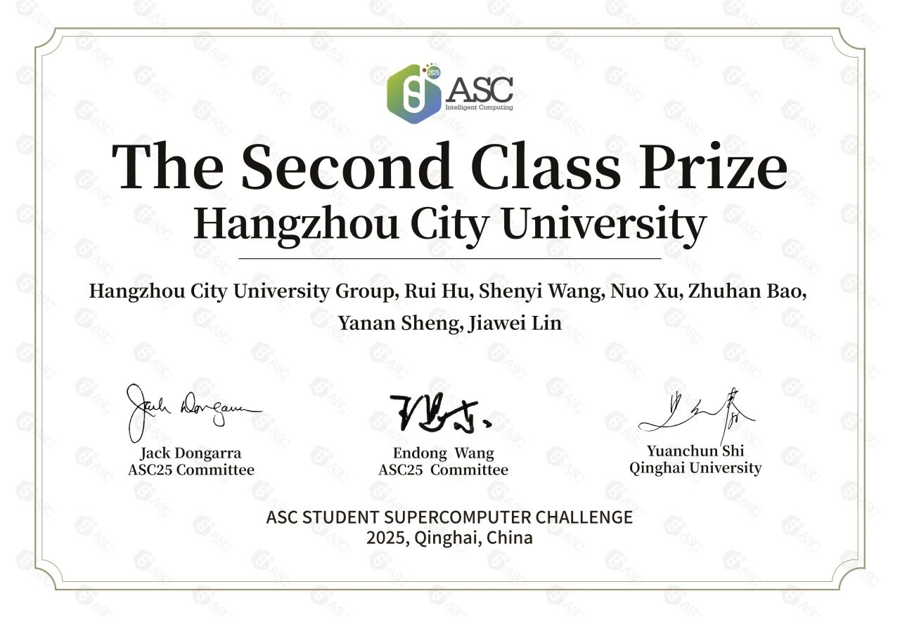
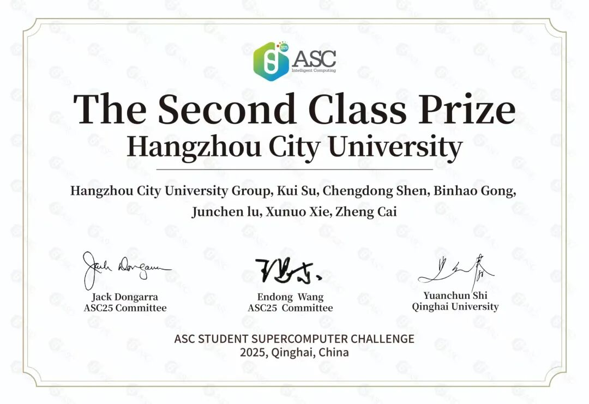

<!--more-->

在第12届ASC世界大学生超级计算机竞赛（ASC Student Supercomputer Challenge）中，我校两支参赛队伍凭借出色的表现，再次斩获国际二等奖的优异成绩。这是继2024年首次参赛以来，我校超算团队连续第二年获得该项国际顶级赛事的二等奖，充分展现了我校在高性能计算领域的持续进步和雄厚实力。

ASC竞赛作为全球最具影响力的大学生超算赛事之一，以其前沿的赛题设计和极高的技术难度著称。本届竞赛延续这一传统，精心设置两大极具挑战性的赛题——RNA甲基化修饰位点检测性能优化与AlphaFold3跨平台推理优化，充分体现了当前高性能计算与人工智能技术深度融合的发展趋势。

面对这些前沿课题，我校超算队对业界最新的优化算法进行了系统性的调研和分析，结合具体的软硬件环境，创造性地提出了独具特色的优化方案。这些方案在超算应用分析、性能瓶颈突破、并行计算策略设计等方面都体现出极高的技术水平，充分发挥了浙大城市学院超算中心平台的计算潜力。

自创办以来，ASC竞赛始终秉持"以赛促学、以赛促研"的宗旨，致力于为全球超算青年人才搭建高水平的交流平台。通过十二年的持续发展，ASC已经成长为覆盖全球六大洲、吸引上万名大学生参与的顶级赛事，在推动超算技术发展、培养创新人才、促进产学研融合等方面发挥着不可替代的作用。

**2025年由学校超算中心组织的超算队招新正式启动！**

诚邀各专业对高性能计算、并行计算及性能优化感兴趣的同学加入。请将个人简历发送至报名邮箱 [hur@hzcu.edu.cn](mailto:hur@hzcu.edu.cn)，邮件标题请按`[25年超算队招新+姓名]`格式命名。

期待与你一起探索超算技术的无限可能！

转自计算机与计算科学学院官网2025年6月27日发布